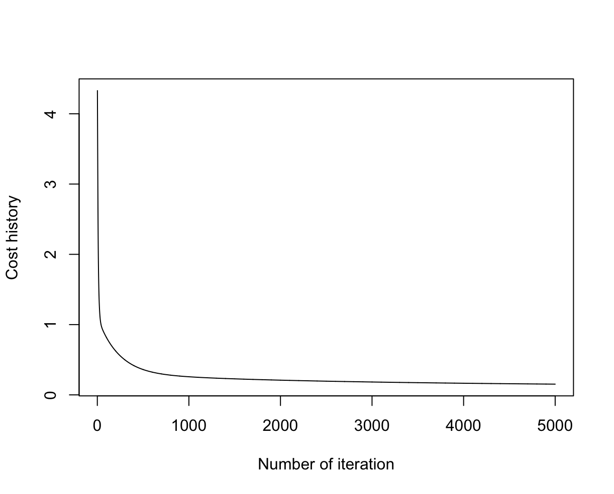

M2_RPackage
==========

The rlgd package is intended to provide the best statistical model to study the relationships between a set of explanatory variables Xi and a target variable Y. It uses the binary logistic regression algorithm with the stochastic gradient descent method to predict the probability of an event occurring (value of 1) or not (value of 0) based on the optimisation of the regression coefficients.

Installing the package
----------------------

    devtools::install_github("Romain8816/M2_RPackage")

Tutorial for package usage
--------------------------

### Loading the library

Once the package is installed, the library can be load using the standard commands from R.

    library(M2_RPackage)

### Dataset Import

First, you need to import a dataset (with a set of categorical variables Xi and a categorical variable Y). In this example, we will use the breast_cancer dataset. This dataset is included in the M2_RPackage package.

    M2_RPackage <- M2_RPackage::breast_cancer

The breast_cancer dataset includes information on patient cells and contains 9 explanatory variables and 1 binary target variable: class which takes the value malignant or begnin.

The dataset is therefore in the *breast_cancer* object, so we can start fitting our linear model.

**Note: If you are unsure about a function, use **help(name_function)** or **?name_function** , example: **?fit**.

------------------------------------------------------------------------

Data preparation
----------------

### Conversion of the target variable to 0/1 if it is not the case

### Separation of training and test samples

### Overview of data with get_x_y function

### Example 1 with "batch" mode : 

    res1 <- fit(classe ~ ., train_set, mode = "batch", batch_size = 32, learning_rate = 0.01, max_iter = 40000, tol = 1e-4)
    
    plot(seq(1, length(res1$cost_history)), res1$cost_history, type = "l")
    

    
    y_pred <- predict(res1, test_set[, res1$x_names], type = "class")
    accuracy <- mean(y_pred == test_set[, res1$y_name])
    print(accuracy)
    

### Example 2 with "online" mode : 

### Example 2 with "mini-batch" mode : 

------------------------------------------------------------------------

### That’s it!

This is the end of the overview of the main functions of our package. Let's practise !

